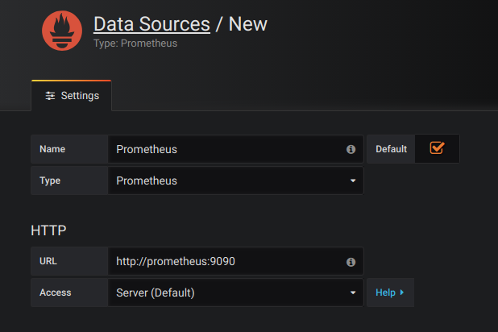

# Prometheus Swarm

A sample image that can be used as a base for collecting Swarm mode metrics in Prometheus

## How to use it

You can use the provided `docker-stack.yml` file as an example. You can deploy the full stack with the command:

### Create overlay network
Before deploying, you need to create an overlay network for monitoring with prometheus

```bash
docker network create --driver overlay --attachable monitoring
```

### Set label on a specific host
Prometheus uses internal TSDB which needs a persistent volume
I set the constraint on Prometheus service therefore you should set the service=prometheus label
```
docker node update --label-add service=prometheus infa-swarm-t1003
```

### Deploy prometheus stack
```bash
docker stack deploy -c docker-compose-stack.yml prometheus
```
You might need to apply this IPTables rule to work docker-exporter service
This rule will allow the container to reach the host on it's own exposed port which is 4999
```
iptables -I INPUT 1 docker_gwbridge -j ACCEPT
```

### Deploy Grafana Dashboard
```bash
docker stack deploy -c grafana.yml grafana
```

Now you can access your Grafana dashboard via this URL

* http://<IP one of your swarm node>:3000

### Add a data source



### Import Dashboards

You can find some predefined dashboard JSON files in the grafana directory

Import them to create essential dashboards

* Prometheus 2.0 stats Dashboard: prometheus-stats.json
* Docker Swarm Nodes Dashboard: docker-swarm-node.json  
* Docker Swarm Services Dashboard: docker-swarm-service.json  
* Node Exporter Full Dashboard: node-exporter.json  

